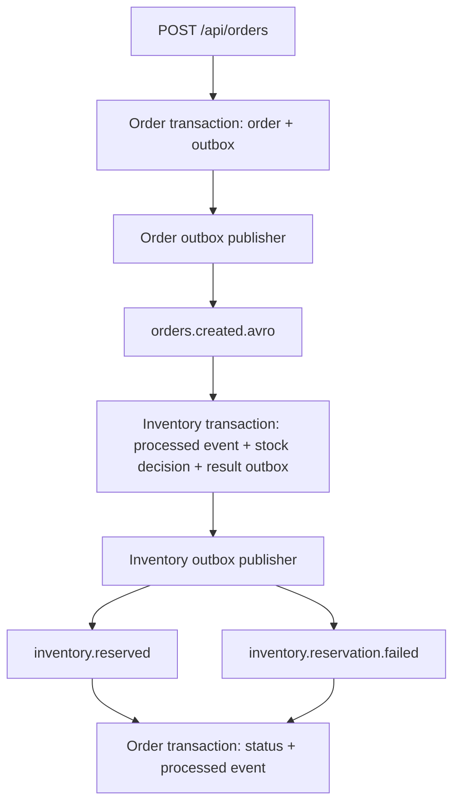

# 01 · Project Overview & Architecture

## 🗣️ Project introduction — say this once

> I built a Kafka-based order processing platform using Java 17 and Spring Boot. It has two services: Order and Inventory. The Order Service accepts requests and stores orders. The Inventory Service checks stock and sends the reservation result back. I used transactional outboxes and idempotent consumers to handle publication failures and duplicate delivery. I also added retry handling, a dead-letter topic, monitoring, and a Jenkins pipeline for local container deployment.

**Bolne ka order:** purpose → services → reliability → delivery.

## 🟦 Core concepts

- **Event-driven:** services react to events to perform their work. Event aaya, tab next service ka kaam start hota hai.
- **Loose coupling:** services depend on event contracts rather than direct calls for this workflow. Producer ko consumer ki immediate response ka wait nahi.
- **Eventual consistency:** related service states become consistent after events are processed. Order status turant final nahi hota.

## 🟩 Each tool's role

| Tool | Role |
|---|---|
| MySQL + JPA/Hibernate | Durable business data and local transactions |
| Kafka + three-node KRaft | Event transport, replication and metadata control |
| Avro + Schema Registry | Order-event schema and compatibility management |
| Actuator + Micrometer | Health and metrics exposure |
| Prometheus + Grafana | Inventory metrics collection, dashboards and alerts |
| Docker + Jenkins + Docker Hub | Packaging, CI/CD and versioned images |

## 🟪 Why Kafka instead of only REST?

I wanted asynchronous processing so order acceptance would not wait for inventory processing. The trade-off is delayed final status and more failure-handling work.

## 🧭 Architecture walkthrough

- Client supplies productId, quantity and amount. HTTP 202 accepts the order; it does not confirm stock reservation.
- Order data belongs to order_db; Inventory data belongs to inventory_db.
- Source event is Avro; Inventory result events are JSON.
- Successful reservation leads to INVENTORY_RESERVED; insufficient stock leads to INVENTORY_REJECTED.
- Manual ACK follows transactional processing. Duplicate event IDs skip repeated business effects (Chapter 04).
- The configured retryable technical-failure path is an initial attempt plus two retries, with two-second backoff; successful recovery publishes to orders.created.avro-dlt (Chapter 05).

## 🟧 Scope

At-least-once delivery; MySQL commit and Kafka offset commit remain separate. Order and inventory only: no payment, shipping or live delivery tracking. Local Docker/Jenkins deployment; controlled replay is a proof-of-concept.

**Source:** [Current project](https://github.com/alexsaifee786-jpg/kafka-order-platform), README, OrderController, Inventory service/consumer.
