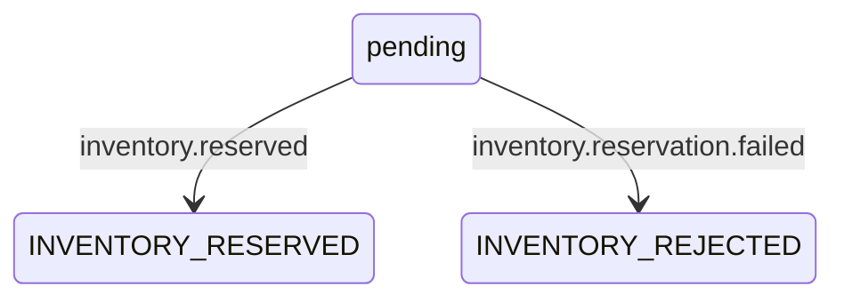

# 07 · Results & Order Lifecycle

_Close the asynchronous loop • Correlate events • Understand state boundaries_

## 🗣️ Say it in the interview

> “Inventory publishes either a reserved or a rejected result through its own outbox. Order Service consumes that result and updates the order in a transaction with a processed-event record. The initial HTTP response only accepts the order; the final inventory outcome arrives asynchronously.”

## TWO BUSINESS OUTCOMES

## IDENTITY & TRANSACTION BOUNDARIES

- **eventId:** identifies this result event. **sourceEventId:** links it to the original OrderCreated event. **orderId:** identifies the business order.
- Inventory transaction creates the result outbox alongside its business work. Its publisher sends the corresponding JSON event using orderId as key.
- Order's markInventoryReserved(...) and markInventoryRejected(...) are both **@Transactional**: status update + processed marker commit together. The listeners ACK afterwards.

## WHAT A SLOW RESULT MEANS

- If the result outbox is still PENDING, Inventory may already have committed its decision while Order still shows pending. Trace the result publisher and Order consumer before retrying the client request.
- The Inventory publisher calls **send(...).get()** without an explicit future-wait timeout. It does not yet have the Order publisher's interruption hardening.

## DO NOT OVERSTATE THE WORKFLOW

- Duplicate protection is covered in Chapter 04; it does not validate every possible state transition. Current setters do not enforce a complete lifecycle state machine.
- Two result topics do not provide a shared global order. Distinct conflicting result events need stronger transition/version rules if introduced.
- This is an inventory decision workflow, not a complete payment/shipping saga. There is no compensation engine or guaranteed end-to-end completion deadline.

> **Recall:** YAAD RAKHO: HTTP accepted ≠ inventory decision; result event closes the loop.

**Verified source:** [Inventory result publisher + Order result consumers + OrderApplicationService](https://github.com/alexsaifee786-jpg/kafka-order-platform/blob/main/order-service/src/main/java/com/aryan/kafka/orderservice/service/OrderApplicationService.java)

Personal hands-on project. Source inspection on 29 Sep 2026; no new runtime test claimed.
